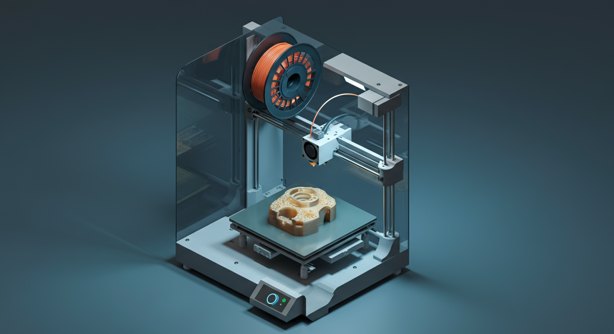

# Inicio — Wiki FiLL-3D

Bienvenido a la wiki oficial de FiLL-3D, tu referencia técnica para imprimir mejor con filamentos fabricados en Colombia. Aquí encuentras desde los conceptos más básicos hasta los ajustes más avanzados — todo en un solo lugar, sin importar si llevas una semana o cinco años imprimiendo. Esta wiki es para ti: para que saques el máximo provecho de tu impresora y de tus filamentos FiLL-3D.

Si estás comenzando, te recomendamos ir directo a **Lo Básico** y leer en orden — ahí encontrarás todo lo que necesitas para empezar con buen pie. Si ya tienes experiencia, salta a **Consejos de Impresión** para optimizar tus resultados. Y si en cualquier momento te topas con un término que no reconoces, el **Glosario** está siempre disponible como referencia rápida.

---

## Lo Básico

Todo lo que necesitas saber para comenzar a imprimir con confianza, desde cero.

[Explora la sección completa: Lo Básico](lo-basico/index.md)

- [Primeros Pasos](lo-basico/primeros-pasos/index.md) — Guías de acción inmediata para estrenar una impresora o un material nuevo por primera vez.
- [Calibración](lo-basico/calibracion/index.md) — Cómo verificar y afinar tu impresora usando tests estándar: cubo de calibración, Benchy y metodología Orca Slicer.
- [Introducción a la Impresión 3D](lo-basico/introduccion-impresion-3d.md) — Qué es la impresión 3D, cómo funciona y por qué es tan versátil.
- [Materiales de Impresión 3D](lo-basico/materiales-impresion-3d.md) — Panorama general de los tipos de filamento y cómo elegir el indicado para tu proyecto.
- [Impresoras 3D](lo-basico/impresoras-3d.md) — Tipos de impresoras, sus partes principales y cómo mantenerlas en buen estado.
- [Slicers](lo-basico/slicers.md) — Qué es un slicer, cuáles son los más usados y cómo configurar los parámetros esenciales.
- [Fichas de materiales: PLA, PETG, PA, PP y más](lo-basico/materiales-impresion-3d.md) — Fichas técnicas detalladas con parámetros de impresión recomendados para cada material FiLL-3D.

---

## Consejos de Impresión

Guías prácticas para resolver problemas, afinar tus impresiones y entender el comportamiento de los materiales.

[Explora la sección completa: Consejos de Impresión](consejos-de-impresion/index.md)

- [Por Tipo de Material](consejos-de-impresion/por-tipo-de-material.md) — Ajustes y recomendaciones específicas para PLA, PETG, PA, PP y más.
- [Problemas Comunes](consejos-de-impresion/problemas-comunes.md) — Diagnóstico y solución para los problemas más frecuentes: warping, stringing, capas separadas y otros.
- [Post-Procesado](consejos-de-impresion/post-procesado.md) — Técnicas para lijar, pintar, soldar y terminar tus piezas impresas.
- [Ciencia de Materiales](referencia-tecnica/ciencia-de-materiales.md) — Para entender a fondo por qué los materiales se comportan como lo hacen bajo calor, carga y humedad.

---

## Glosario

¿Te topaste con un término que no conoces? El [Glosario Técnico](referencia-tecnica/index.md) reúne las definiciones de los conceptos más usados en el mundo de la impresión 3D — desde términos básicos hasta los más especializados, organizados por categoría para encontrarlos rápido.

---

## Preguntas Frecuentes

**¿Qué material uso para piezas funcionales?**
Depende del nivel de exigencia mecánica y térmica. Para la mayoría de las piezas funcionales de uso general, el PETG es un excelente punto de partida: es más resistente que el PLA y tolera temperaturas más altas. Si la pieza va a soportar cargas elevadas o ambientes agresivos, considera el PA (Nylon) o el PP. Revisa la [página de Materiales de Impresión 3D](lo-basico/materiales-impresion-3d.md) para una comparativa completa.

**¿Por qué se despegan las esquinas de mi impresión?**
Lo que describes se llama **warping** y ocurre cuando el material se contrae al enfriarse de forma desigual, levantando las esquinas de la pieza. Las causas más comunes son una cama mal nivelada, temperatura de cama insuficiente o un ambiente con corrientes de aire. En la [página de Problemas Comunes](consejos-de-impresion/problemas-comunes.md) encontrarás el diagnóstico completo y la solución paso a paso.

**¿Qué es el PLA Turbo?**
El [PLA Turbo](lo-basico/materiales/pla.md) es la variante de alta velocidad de FiLL-3D, formulada para impresoras con sistemas de movimiento rápido como CoreXY. Mantiene las ventajas del PLA estándar pero está optimizado para velocidades superiores sin sacrificar adhesión entre capas ni detalle superficial — que tu limitación no sea el material.

**¿Cómo contacto a FiLL-3D?**
Puedes comunicarte con el equipo de FiLL-3D por WhatsApp o llamada al **(314) 745-8472**. También puedes visitar el sitio web en [fill-3d.com/contactanos](https://www.fill-3d.com/contactanos/) donde encontrarás más canales de contacto y toda la información sobre los productos y el servicio postventa.

---

¿Listo para imprimir mejor? Visita la tienda de FiLL-3D y encuentra el filamento ideal para tu próximo proyecto: [fill-3d.com/tienda](https://www.fill-3d.com/tienda/)