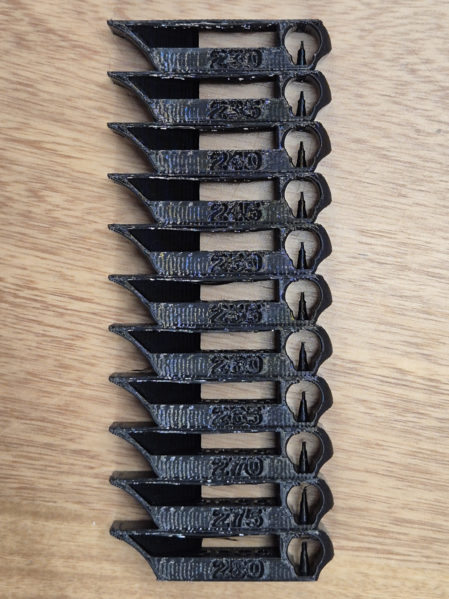
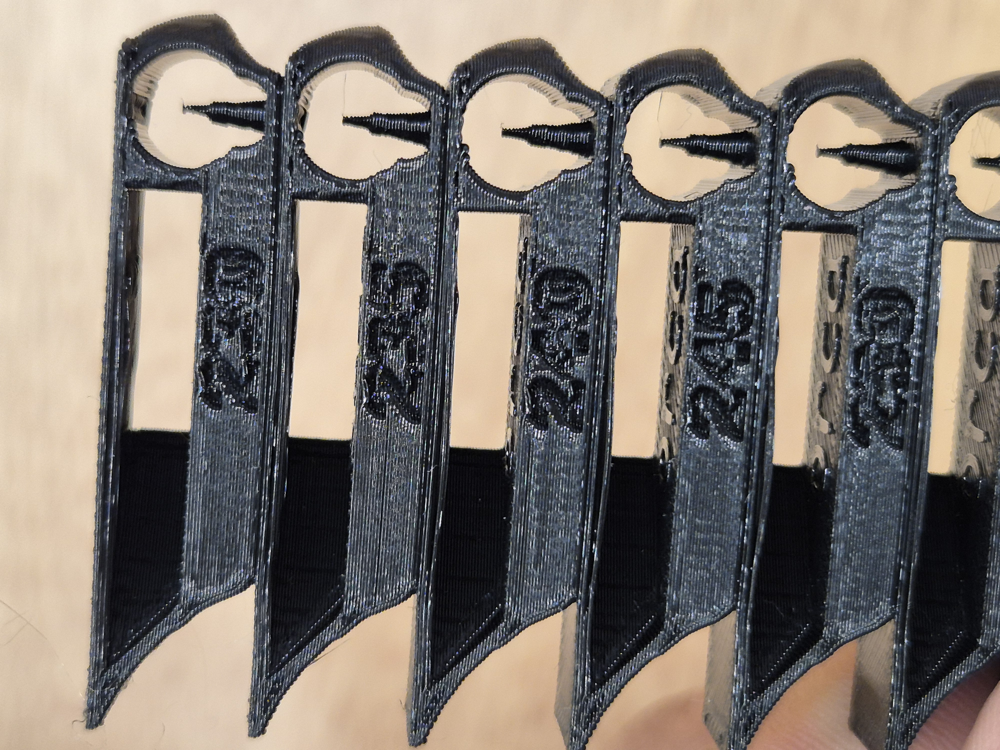
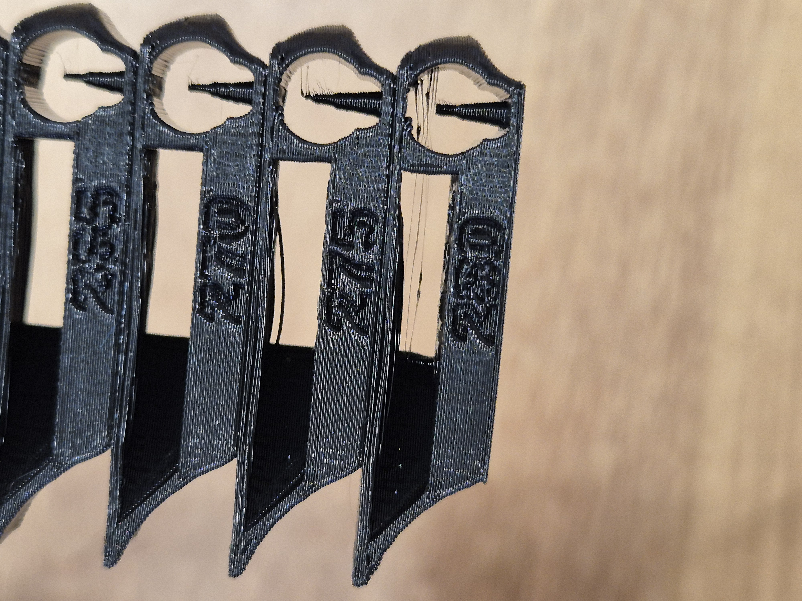
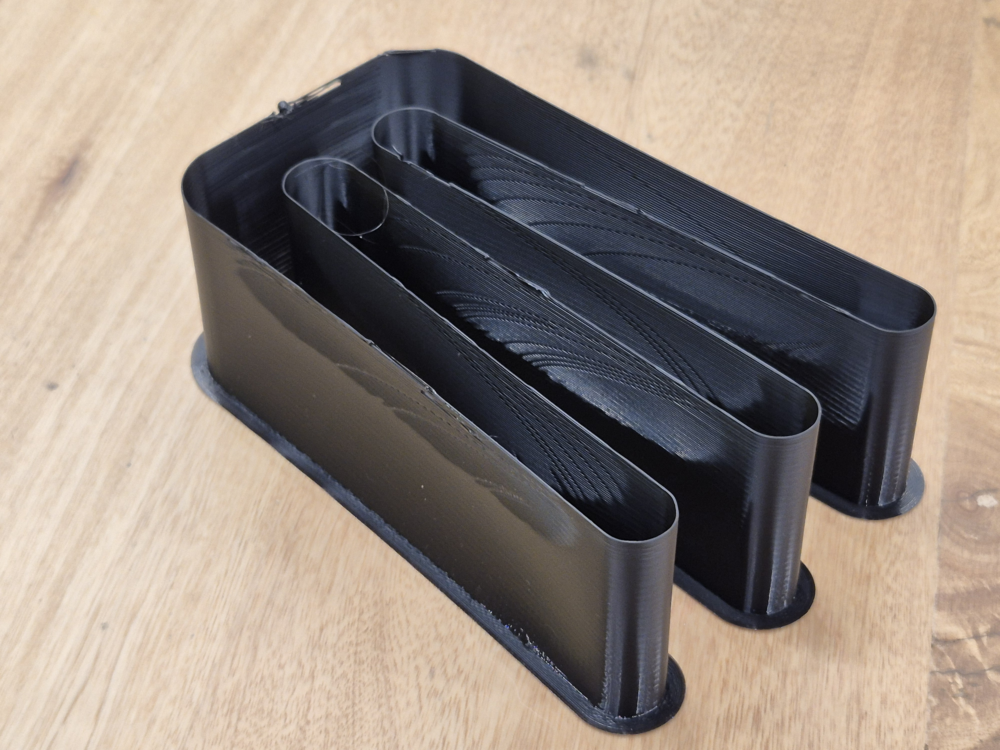
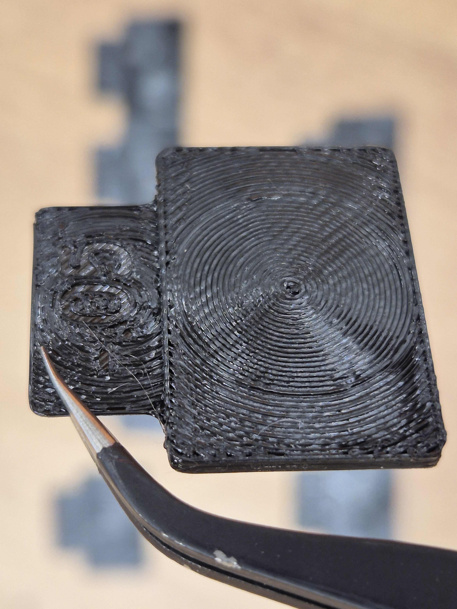
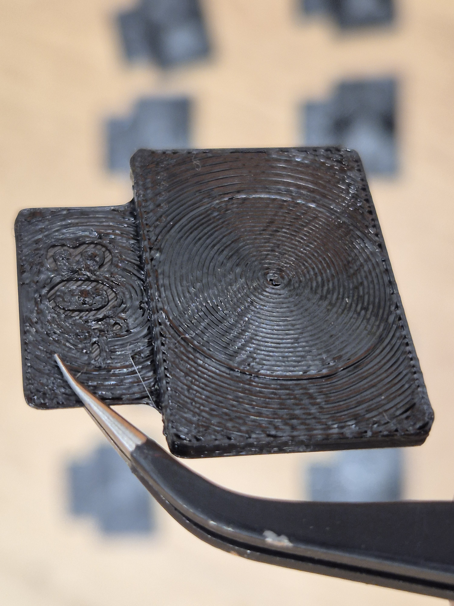
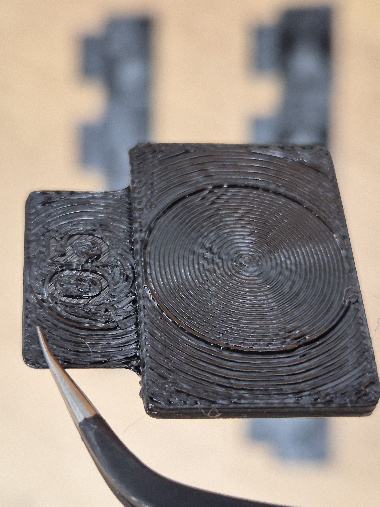

# Calibración de Filamento con Orca Slicer

> La metodología paso a paso para encontrar los parámetros óptimos de cualquier filamento usando las herramientas integradas de Orca Slicer.

---

## Para Principiantes

Orca Slicer es un slicer open source y gratuito que, a diferencia de otras opciones, trae herramientas de calibración integradas directamente en la interfaz. Eso significa que no necesitas buscar archivos externos ni seguir tutoriales dispersos: el propio software te guía para encontrar los mejores parámetros para cada filamento que uses.

Calibrar no es obligatorio para que la impresora funcione, pero sí es necesario para que imprima *bien*. Piénsalo como afinar un instrumento antes de tocar: la impresora puede operar "desafinada" y producir resultados aceptables, pero cuando ajustas cada parámetro al filamento específico, la diferencia en calidad de superficie, resistencia mecánica y precisión dimensional es evidente.

Esta metodología es específica de Orca Slicer. Bambu Studio tiene herramientas equivalentes porque deriva del mismo proyecto base. Otros slicers como Cura o PrusaSlicer existen calibraciones también, pero con procedimientos distintos que no cubre esta página.

---

## Todo lo que Necesitas Saber

La clave de la metodología de Orca es el **orden**: cada test parte de que el anterior ya está ajustado. Saltar pasos o hacerlos en desorden produce resultados poco confiables.

### 1. Temperature tower (Torre de temperatura)

**Qué mide:** La temperatura óptima de boquilla para el filamento específico que estás usando.

**Qué modifica:** La temperatura de boquilla en el perfil de filamento.

**Cómo leer el resultado:** Observa cada sección de la torre e identifica la temperatura más baja que produzca buena adhesión entre capas sin generar stringing excesivo. Priorizar la temperatura más baja que funcione bien ayuda a reducir el babeo y alargar la vida del hotend.

En la figura 1 puedes ver la torre completa (Fig. 1a), la primera sección con buen rendimiento a 240 °C (Fig. 1b) — por debajo de esta temperatura se corre el riesgo de reducir las propiedades mecánicas de la pieza — y el stringing severo que aparece cuando la temperatura es excesiva (Fig. 1c).

  <figure style="flex: 1; margin: 0; text-align: center;">
    
    <figcaption><em>Fig. 1a — Torre completa (230 °C–280 °C)</em></figcaption>
  </figure>
  <figure style="flex: 1; margin: 0; text-align: center;">
    
    <figcaption><em>Fig. 1b — Temperatura óptima (~240 °C): primera sección con buen rendimiento</em></figcaption>
  </figure>
  <figure style="flex: 1; margin: 0; text-align: center;">
    
    <figcaption><em>Fig. 1c — Temperatura excesiva: stringing severo</em></figcaption>
  </figure>

### 2. Max Volumetric Speed (Flujo volumétrico máximo)

**Qué mide:** La velocidad máxima a la que el hotend puede fundir y empujar filamento antes de que aparezca subextrusión. Es un límite físico del equipo con ese material específico, no un multiplicador de cantidad.

**Qué modifica:** El valor de flujo volumétrico máximo (mm³/s) en el perfil de filamento. Este valor actúa como techo: el slicer nunca pedirá al hotend más volumen por segundo del que puede procesar.

**Cómo leer el resultado:** El test imprime a velocidades de flujo crecientes. En la figura 2 puedes ver la pieza completa del test (Fig. 2a) y las zonas de resultado anotadas (Fig. 2b): la zona verde (acabado brillante) y amarilla (acabado mate) corresponden al rango óptimo; la zona roja indica pérdida de adhesión entre capas, y la zona roja oscura falla total. Para obtener el valor numérico, mide la altura en la pieza hasta el punto óptimo identificado y lee directamente en Orca Slicer cuál es el flujo volumétrico asignado a esa altura. El valor seguro se establece ligeramente por debajo de ese punto.

  <figure style="flex: 1; margin: 0; text-align: center;">
    
    <figcaption><em>Fig. 2a — Pieza de test impresa</em></figcaption>
  </figure>
  <figure style="flex: 1; margin: 0; text-align: center;">
    
    <figcaption><em>Fig. 2b — Cómo leer los resultados: zonas de calidad anotadas</em></figcaption>
  </figure>

**Por qué va antes del flujo y del Pressure Advance:** Si el hotend está intentando empujar más material del que puede fundir, todos los tests posteriores medirán sobre una base inestable. Establecer este límite primero garantiza que los demás tests operen dentro del rango en que el equipo es capaz de responder con precisión.

### 3. Pressure Advance / Linear Advance

**Qué mide:** La compensación de presión acumulada en el hotend durante aceleraciones y desaceleraciones bruscas.

**Qué modifica:** El valor K de Pressure Advance (firmware Klipper) o Linear Advance (firmware Marlin).

**Tipos de test disponibles:**

- **PA Line (recomendado por FiLL-3D):** El más rápido de los tres. Imprime una serie de líneas paralelas, cada una con un valor de PA distinto. Se identifica la línea más uniforme a lo largo de toda su longitud — sin blobs en los extremos ni adelgazamientos — y ese valor se guarda en el perfil de filamento.
- **Tower:** Imprime una torre vertical; cada sección corresponde a un valor de PA distinto. Se busca la altura donde las esquinas se ven más limpias y se calcula el valor con la fórmula `PA = inicio + (paso × altura)`. Más robusto ante variaciones de primera capa que el método Line.
- **Pattern:** Basado en el método de Andrew Ellis. Imprime prismas rectangulares con G-code personalizado por capas. Permite mayor control sobre los parámetros del test, pero es más lento de ejecutar e interpretar.

> **Nota:** El método PA Line depende directamente de la calidad de la primera capa. Si la cama no está bien nivelada, todas las líneas aparecerán irregulares por esa razón — no por el PA — y el test no será confiable. Recomendamos ejecutar la nivelación automática de la cama antes de realizar este test.

**Cómo leer el resultado (PA Line):** Examina las líneas impresas buscando la más uniforme: ancho consistente de extremo a extremo, sin acumulaciones en los cambios de dirección y sin adelgazamientos antes de las esquinas. Un valor demasiado bajo produce blobs; uno demasiado alto genera líneas adelgazadas o con huecos. El valor de esa línea se ingresa directamente en el perfil de filamento. En la figura 3 puedes ver el resultado de un PA Line: los recuadros rojos delimitan las zonas de lectura en los extremos de cada línea (donde se manifiestan los blobs o adelgazamientos), y el recuadro verde señala la línea más uniforme — el valor óptimo identificado. Para mayor detalle, ver la [documentación oficial de calibración de Pressure Advance](https://github.com/OrcaSlicer/OrcaSlicer/wiki/pressure-advance-calib).

<figure style="margin: 1em 0; text-align: center;">
  
  <figcaption><em>Fig. 3 — Resultado de PA Line: zonas de lectura (rojo) y valor óptimo identificado (verde)</em></figcaption>
</figure>

### 4. Flow calibration (Tasa de flujo)

**Qué mide:** Que el volumen de material depositado corresponde exactamente al modelo digital. A diferencia del flujo volumétrico máximo — que establece cuánto puede empujar el hotend — la tasa de flujo calibra cuánto debe empujar para que las dimensiones impresas coincidan con las del modelo.

**Qué modifica:** El multiplicador de flujo (flow ratio) en el perfil de filamento.

**Cómo leer el resultado (método YOLO — recomendado para Orca Slicer ≥ 2.3.0):** El test genera once bloques, cada uno con un modificador de flow ratio distinto respecto al valor actual. Se identifica el bloque con la mejor superficie superior: sin huecos entre los arcos del patrón y sin línea visible entre la espiral interior y los arcos exteriores. El nuevo flow ratio se calcula con la fórmula `flow ratio anterior ± modificador del bloque ganador`. En la figura 4 puedes comparar tres bloques del mismo test: en la Fig. 4a (subextrusión, modificador −0.05) observa los espacios vacíos que quedan entre cordones en la superficie superior; en la Fig. 4b (bloque ganador, modificador −0.03) la superficie es notablemente más uniforme y sin huecos; en la Fig. 4c (sobreextrusión, modificador +0.05) aparece un relieve central elevado por el exceso de material. Como ejemplo práctico: en esta calibración de PET el flow ratio base del perfil era 0.97; al restarle el modificador ganador de 0.03, el flow ratio final queda en 0.94. Para mayor detalle sobre cómo leer los bloques, ver la [documentación oficial del método YOLO](https://github.com/OrcaSlicer/OrcaSlicer/wiki/flow-ratio-calib#orcaslicer--230-archimedean-chords--yolo-recommended).

  <figure style="flex: 1; margin: 0; text-align: center;">
    
    <figcaption><em>Fig. 4a — Subextrusión (mod. −0.05): espacios vacíos entre cordones</em></figcaption>
  </figure>
  <figure style="flex: 1; margin: 0; text-align: center;">
    
    <figcaption><em>Fig. 4b — Bloque ganador (mod. −0.03): superficie uniforme</em></figcaption>
  </figure>
  <figure style="flex: 1; margin: 0; text-align: center;">
    
    <figcaption><em>Fig. 4c — Sobreextrusión (mod. +0.05): relieve central elevado</em></figcaption>
  </figure>

### 5. Retraction test (Test de retracción)

**Qué mide:** La distancia y velocidad de retracción óptimas para eliminar stringing (hilos entre partes separadas del modelo).

**Qué modifica:** Distancia de retracción y velocidad de retracción en el perfil de filamento.

**Cómo leer el resultado:** El test imprime torres separadas con diferentes combinaciones de distancia y velocidad. Se busca la combinación que produce menos hilos. Un dato a tener en cuenta: los extrusores directos trabajan con valores de retracción menores que los sistemas bowden. Para los rangos de referencia por tipo de filamento, consulta [Por Tipo de Material](../../consejos-de-impresion/por-tipo-de-material.md).

### 6. Tolerance test (Test de tolerancias) — opcional

**Qué mide:** La tolerancia dimensional de la impresora para piezas funcionales que requieren encajes precisos.

**Qué modifica:** La compensación de contorno XY (XY contour compensation) en el slicer.

**Cómo leer el resultado:** El modelo incluye ranuras de diferentes tolerancias. Se identifica cuál encaja correctamente con una pieza de referencia y ese valor se registra como la compensación dimensional del equipo. Este test es opcional para quien imprime principalmente piezas decorativas o prototipos visuales.

### Parámetros de referencia FiLL-3D por material

Valores de partida recomendados para los filamentos FiLL-3D. Úsalos como punto de inicio antes de calibrar con los tests anteriores.

| Material | Temp. boquilla (°C) | Flujo vol. máx. (mm³/s) | Pressure Advance K | Flow ratio (%) | Retracción (mm @ mm/s) | Temp. cama (°C) | Temp. ambiente (°C) | Enfriamiento (% ventilador) | Tiempo mín./capa (s) |
| --- | --- | --- | --- | --- | --- | --- | --- | --- | --- |
| PLA básico | 200–220 | 32 | 0.021 | 95 | 0.2–0.5 @ 35 (DD) / 1–2 @ 45 (bowden) | 50–60 | — | 100% | — |
| PLA Turbo | 220–240 | 55 | 0.018 | — | 0.1 @ 55 | 35–60 | — | 100% desde capa 2 | ≥2 |
| PETG | 265 ±5 | 28 | 0.059 | 94 | 0.2 @ 35 | 80 | — | 30–50% desde capa 3 | ≥4 |
| PA (Nylon) | 275 | 18 | 0.038 | 97.5 | 2 @ 40 | 100 | 40–60 | 0% (primeras 10 capas) → 10–50% | ≥5 |
| PP | 300 | 12 | 0.085 | 104.5 | 0.2 @ 40 | 100 | 40–60 | 0% (primeras 5 capas) → 20–30% máx. | ≥5 |
| PPCF | 300 | 17 | 0.044 | 101.5 | 0.2 @ 45 | 80 | 40–60 (recomendada) | 0% (primeras 5 capas) → 80% | ≥5 |

Para más detalles sobre cada material, incluyendo tips de secado y post-procesado, consulta [Consejos por Tipo de Material](../../consejos-de-impresion/por-tipo-de-material.md).

---

## Para Expertos

**Orden correcto de calibración — máquina antes que filamento:** Los parámetros de máquina (tensión de correas, e-steps, input shaping y resonance compensation) deben estar ajustados *antes* de calibrar cualquier filamento. El input shaping en particular afecta directamente la calidad de esquinas y la precisión del Pressure Advance. El orden correcto es: mecánica → input shaping → calibración de filamento.

> **Nota:** Las máquinas modernas suelen incluir opciones de calibración automática o *self-test* que cubren parte de estos ajustes de máquina. Si tu impresora tiene esta función, ejecútala antes de comenzar la calibración de filamento con Orca Slicer. Para más información, consulta [Tu Primera Impresora](../../lo-basico/primeros-pasos/impresora.md).

**Calibración de máquina vs. calibración de filamento:** Esta distinción es operativamente importante. Los parámetros de máquina se calibran una vez por impresora y cambian solo si hay modificaciones físicas. Los parámetros de filamento — temperatura, flow ratio, Pressure Advance, retracción — son por combinación impresora+filamento y deben repetirse al cambiar de material, de marca o incluso de lote del mismo producto.

**Gestión de perfiles en Orca Slicer:** La estructura recomendada es: perfil de impresora base → perfil de proceso → perfil de filamento con fabricante, material y lote identificado. Para sincronizar entre equipos, Orca permite exportar e importar bundles de perfiles, lo que evita recalibrar desde cero en cada máquina.

**Cuándo no confiar en la calibración automática:** El test de Pressure Advance puede arrojar valores engañosos en geometrías con muchos cambios de velocidad consecutivos. Para materiales con flujo variable — como filamentos cargados con fibra de carbono o fibra de vidrio — la calibración de flujo a una sola velocidad puede ser insuficiente; en esos casos conviene medir a múltiples velocidades de impresión y verificar consistencia.

**Metodología complementaria:** La Ellis Print-Tuning Guide cubre casos y parámetros que los tests integrados de Orca no resuelven directamente. Vale la pena conocerla para situaciones avanzadas que escapan al flujo estándar.

---

## También te puede interesar

- [Cubo de Calibración](./cubo-de-calibracion.md)
- [El Benchy y Cómo Leerlo](./benchy.md)
- [Slicers (Laminadores)](../slicers.md)
