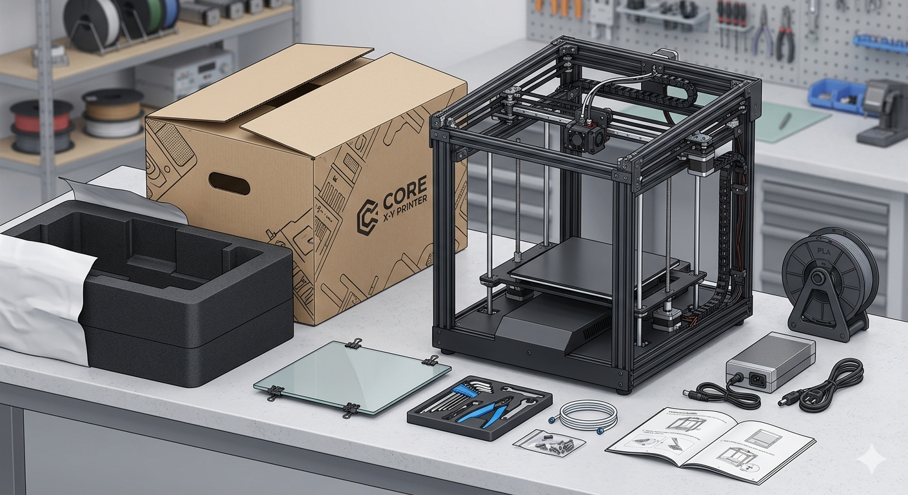

# Estrenando tu Impresora

> Guía práctica para los primeros pasos desde que sacas la impresora de la caja hasta tu primera impresión exitosa.

---

## Para Principiantes

Tu impresora llega ajustada de fábrica — eso es una buena noticia. Pero antes de imprimir tu primera pieza, hay algunos pasos que no puedes saltarte. Piénsalo como armar un mueble nuevo: viene con instrucciones porque aunque casi todo está listo, el montaje final lo haces tú. O como afinar un instrumento musical: el fabricante te entrega el instrumento en buenas condiciones, pero el ajuste fino para tu entorno es tuyo.

El primer día con una impresora 3D tiene su propia curva. Es normal que la primera impresión no salga perfecta — de hecho, sería raro que saliera impecable. Cada espacio tiene su temperatura, su humedad y sus pequeñas particularidades. Los primeros intentos son parte del proceso de calibración, no señales de que algo está mal.

La buena noticia es que si sigues los pasos en orden, reduces mucho las probabilidades de frustrarte. Y si algo no sale bien al primer intento, hay formas sistemáticas de diagnosticar y corregir. Eso es exactamente lo que esta guía te enseña.

---

## Todo lo que Necesitas Saber

### 1. Inspección física del empaque y las partes

Antes de conectar cualquier cosa, revisa el empaque en busca de daños evidentes — golpes, abolladuras, piezas sueltas dentro de la caja. Los daños en transporte no son raros, y es mucho más fácil reclamar antes de encender el equipo.

Una vez abierta la caja, **verifica el voltaje del selector de alimentación**. En Colombia el voltaje estándar de la red eléctrica es **110 V / 120 V**. Muchas impresoras importadas tienen un selector físico que puede venir configurado para 220 V. Encender la máquina con el voltaje incorrecto puede dañarla permanentemente. Busca el selector cerca de la fuente de poder, revisa el manual y asegúrate de que esté en la posición correcta antes de enchufar.

### 2. Calibración mecánica

Muchas impresoras modernas incluyen una rutina de calibración automática o selftest que corre al encender la máquina por primera vez. Esta rutina cubre pasos como el ajuste de input shaping (para compensar vibraciones) y la nivelación automática de cama (ABL — Auto Bed Leveling). Si tu máquina tiene esta rutina, **ejecútala y no toques la impresora mientras está corriendo** — cualquier movimiento externo puede afectar las mediciones.

En máquinas que no incluyan rutinas automáticas, la calibración mecánica implica dos pasos manuales:

- **Tensión de correas:** revisa que las correas de los ejes X e Y estén bien tensionadas según las indicaciones del manual. Una correa floja genera vibraciones que se ven como ondas en las paredes de la pieza.
- **Nivelación manual de cama:** se ajusta con ruedas o tornillos en las esquinas, haciendo pasar una hoja de papel entre la boquilla y la superficie hasta sentir una ligera resistencia uniforme en todos los puntos.

Sigue el procedimiento del manual de tu impresora. Si es la primera vez, hazlo con paciencia — este paso vale la pena hacerlo bien.

### 3. Carga del filamento por primera vez

Precalienta la boquilla a la temperatura del material que vas a usar (si tu impresora trae filamento de prueba, úsalo para este primer test). Una vez caliente, inserta el filamento por la entrada del extrusor hasta que empiece a salir por la boquilla. Espera a ver una hebra continua y pareja antes de continuar.

### 4. Purga del filamento de prueba incluido

Muchas impresoras vienen con un filamento de muestra precargado. Si vas a cambiar a tu propio material, calienta la boquilla, extruye hasta que el material nuevo salga limpio y homogéneo, y descarta los primeros centímetros de purga.

### 5. Primera impresión de prueba

La mayoría de impresoras incluyen archivos de prueba en la tarjeta SD o memoria interna. Úsalos — están diseñados para ser rápidos y para mostrar si la nivelación básica es correcta. Otra opción recomendada es imprimir un cubo de calibración estándar: consulta la guía [Cubo de Calibración](../calibracion/cubo-de-calibracion.md) para descargar el archivo y entender qué evaluar en el resultado.

### 6. Verificación del resultado

Al terminar la primera impresión, evalúa:

- **Primera capa:** ¿se adhirió correctamente a la cama? ¿está aplastada de manera uniforme o hay zonas más delgadas que otras?
- **Paredes:** ¿son lisas o se ven líneas irregulares?
- **Esquinas:** ¿están definidas o se notan deformaciones?
- **Superficie superior:** ¿está bien cerrada o tiene huecos?

### 7. Primer ajuste si algo no salió bien

No entres en pánico si la primera pieza tiene defectos visibles. La mayoría de los problemas del primer día tienen solución sencilla. Consulta la guía de [Problemas Comunes de Impresión](../../consejos-de-impresion/problemas-comunes.md) para identificar síntomas y aplicar correcciones.

Si quieres entender mejor cómo el tipo de impresora afecta estos pasos — cartesiana básica, CoreXY, delta — la página [Impresoras 3D](../../lo-basico/impresoras-3d.md) explica las diferencias y por qué algunos ajustes varían entre arquitecturas.

> **Nota sobre el filamento:** los filamentos FiLL-3D cuentan con garantía total incluso si ya usaste parte del rollo. Si tienes problemas que apuntan al material y no a la impresora, puedes contactar al equipo FiLL-3D directamente.

---

## Para Expertos

### PID tuning antes de la primera impresión real

Las impresoras de fábrica suelen venir con PIDs genéricos que funcionan, pero rara vez están optimizados para tu entorno. Antes de imprimir cualquier pieza funcional, corre un ciclo de PID autotune para hotend y cama (`M303 E0` y `M303 E-1` en Marlin, o el equivalente en Klipper). Guarda los valores con `M500` o en `printer.cfg`. Una temperatura inestable genera inconsistencias de flujo que son difíciles de distinguir de problemas de filamento.

### Calibración de e-steps / rotation distance

Si la impresora no viene calibrada de fábrica (frecuente en máquinas de bajo costo), verifica los e-steps del extrusor marcando 100 mm de filamento y comparando con lo extruido real. En Klipper el parámetro equivalente es `rotation_distance`. Una calibración incorrecta de entre 5–10 % es suficiente para arruinar las primeras capas y el flow rate de toda la impresión.

### Klipper / Fluidd / Mainsail: flujo de setup diferente a Marlin

Si tu impresora corre Klipper, el flujo de configuración inicial es distinto: el archivo `printer.cfg` es el punto de entrada, no los menús de la pantalla. Configura `[probe]`, `[bed_mesh]` y `[input_shaper]` antes de imprimir en serio. Fluidd y Mainsail ofrecen macros de calibración integradas que vale la pena revisar antes de lanzar la primera pieza.

### Perfil base en el slicer desde cero

Si tu impresora no tiene un perfil oficial en tu slicer preferido (Orca Slicer, PrusaSlicer, Cura), crea uno partiendo de una máquina similar en geometría y modifica: dimensiones del área de impresión, diámetro de boquilla, tipo de extrusor (directo vs. bowden) y límites de velocidad. Los parámetros de filamento los ajustas aparte — el perfil de máquina debe reflejar solo las capacidades físicas del hardware.

---

## También te puede interesar
- [Recibiendo un Material Nuevo](../primeros-pasos/material.md)
- [Impresoras 3D](../../lo-basico/impresoras-3d.md)
- [Problemas Comunes de Impresión](../../consejos-de-impresion/problemas-comunes.md)
