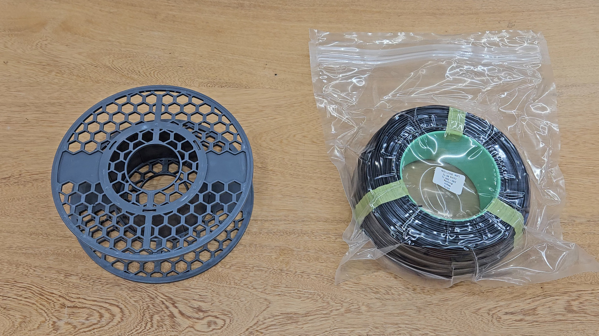
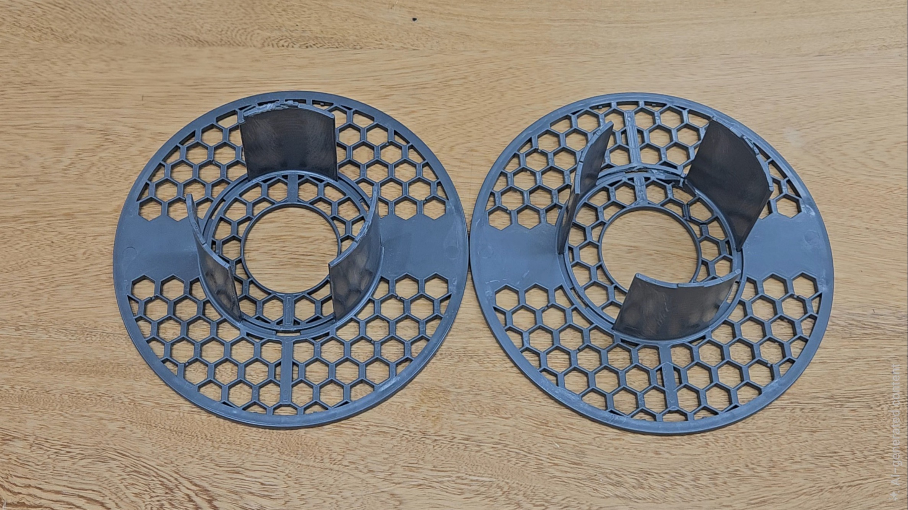
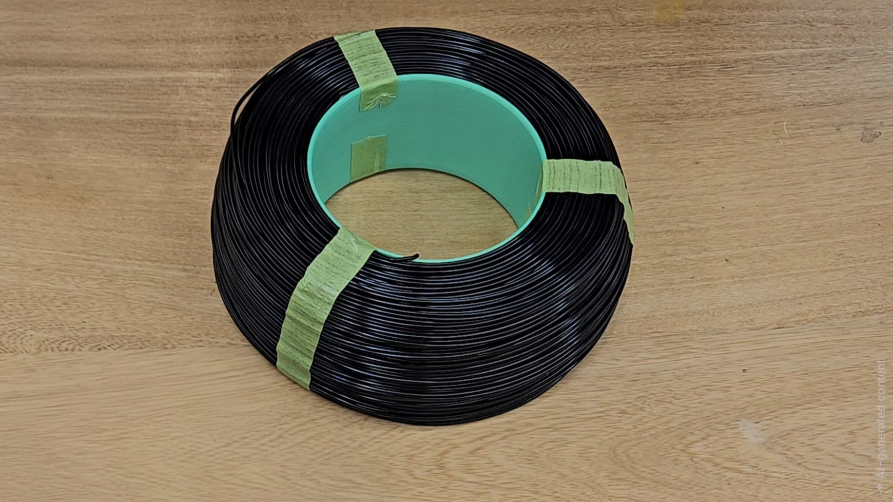
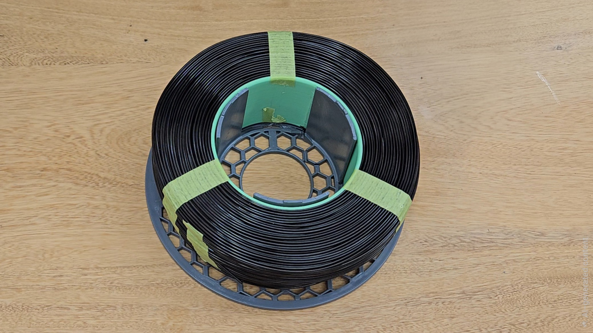
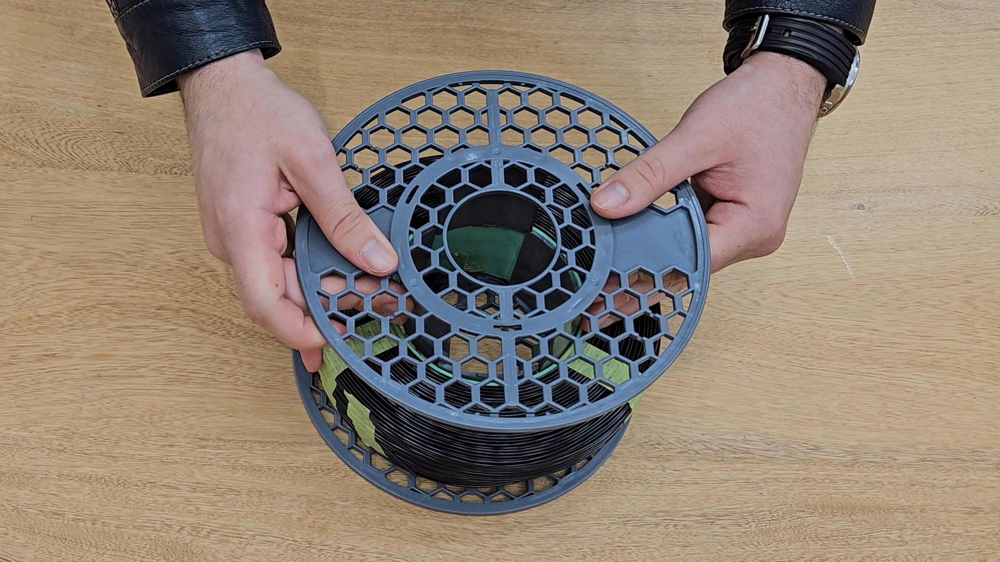
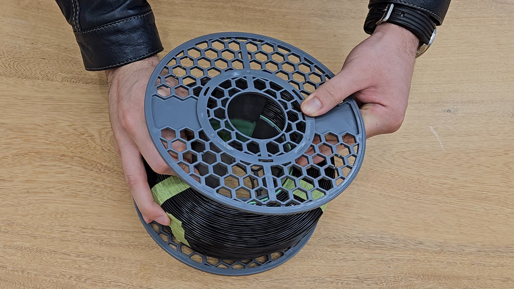
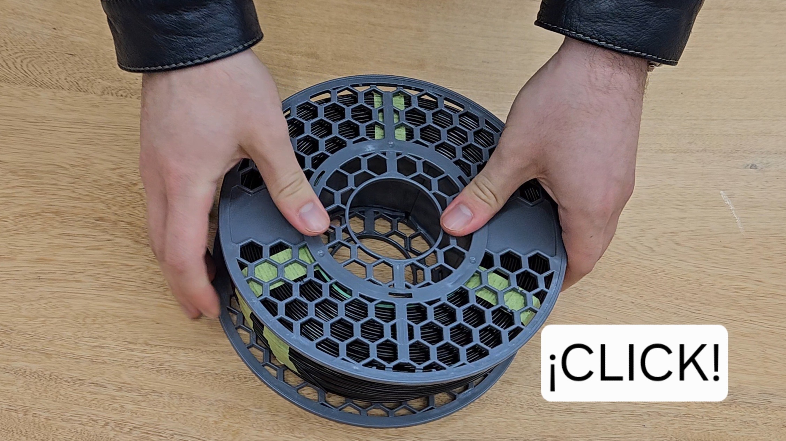
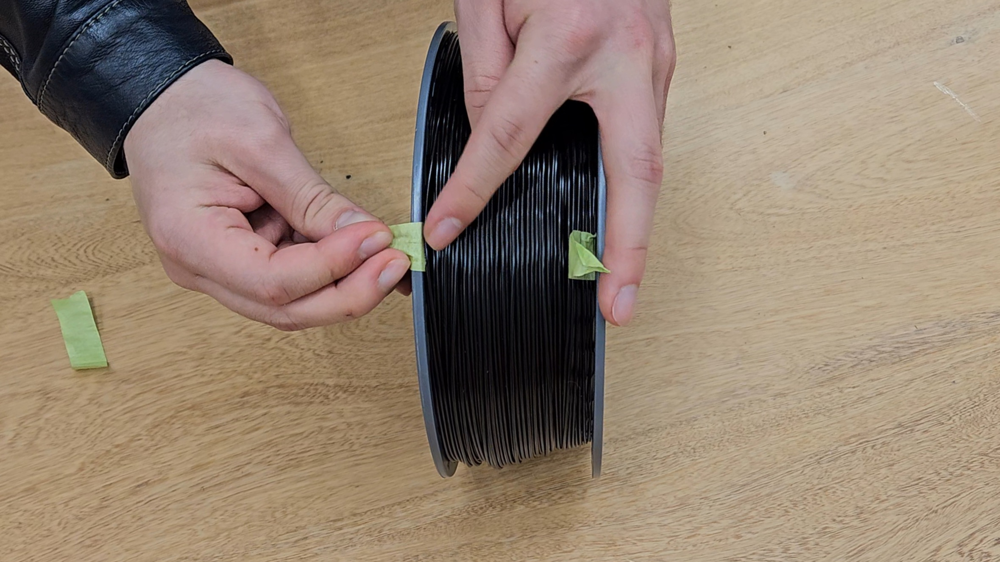

# Cómo Cargar tu Re-Fill en el Carrete

> Carga tu Re-Fill PLA en un carrete reutilizable en 8 pasos simples y sin desperdiciar nada.

El sistema [Re-Fill PLA](https://www.fill-3d.com/tienda/) de Fill3D te permite recargar tu carrete vacío con filamento nuevo sin necesidad de comprar uno completo. Menos plástico, menos empaque, el mismo filamento de calidad. Este proceso toma menos de dos minutos cuando lo haces por primera vez, y aún menos después.

---

## Lo que necesitas

- Tu carrete Fill3D vacío (o uno compatible con el sistema Re-Fill)
- Tu paquete de Re-Fill PLA

No necesitas herramientas.

---

## Paso a Paso

### 1. Abre y orienta el carrete

Separa tu carrete vacío en sus dos mitades. Ábrelo como si fuera un libro y apóyalo sobre la mesa con las dos mitades planas hacia arriba.

> **Importante:** no muevas ni gires el carrete una vez abierto. Conservar la orientación te facilita los pasos siguientes.

---

### 2. Abre la bolsa del Re-Fill — pero no retires las cintas todavía

Abre la bolsa al vacío de tu nuevo Re-Fill. Saca el Re-Fill con cuidado.

> **Importante:** no retires ninguna de las cintas que sujetan el Re-Fill en este momento. Las cintas se retiran solo al final del proceso.

---

### 3. Inserta el Re-Fill en una mitad del carrete

Coloca el Re-Fill sobre una de las dos mitades del carrete.

Verifica que la punta de filamento que sale del centro del Re-Fill **no quede visible** desde el exterior. Si quedara expuesta, rota el Re-Fill respecto al carrete hasta ocultarla.

> **Importante:** al rotar el Re-Fill, evita girar el carrete. Solo el Re-Fill debe moverse.

---

### 4. Cierra el carrete

Une las dos mitades nuevamente, cerrándolas como un libro para mantener la alineación.

En esta primera etapa, inserta únicamente las puntas de las patas — no presiones todavía hasta cerrar por completo.

---

### 5. Verifica la alineación de las patas

Antes de cerrar por completo, revisa que las **3 patas del carrete** hayan encajado correctamente.

Las tres patas deben quedar uniformemente apoyadas contra el núcleo del Re-Fill, sin que ninguna quede torcida o flotando.

---

### 6. Cierra con clic

Una vez confirmada la alineación, presiona las dos mitades del carrete hasta escuchar un **clic**. Ese sonido indica que el cierre quedó completo y seguro.

---

### 7. Retira las 3 cintas del Re-Fill

Ahora sí puedes retirar las cintas. Córtalas por el centro y luego rásgalas en los bordes contra el carrete para sacarlas sin esfuerzo.

Son 3 cintas en total; retíralas todas.

---

### 8. Libera la punta de trabajo

Retira la cinta que sujeta la punta de trabajo de tu filamento. Enhebra esa punta en el soporte del carrete para evitar que el filamento se enrede.

---

## Listo

Tu carrete Re-Fill está cargado y listo para usar. Introdúcelo en tu impresora como lo harías con cualquier carrete Fill3D.

Cuando el filamento se agote, vuelve a separar el carrete, retira el núcleo vacío del Re-Fill y repite el proceso con tu siguiente recarga.

---

## También te puede interesar

- [Recibiendo un Material Nuevo](../lo-basico/primeros-pasos/material)
- [PLA — Ficha de Material](../lo-basico/materiales/pla)
- [Problemas Comunes de Impresión](../consejos-de-impresion/problemas-comunes)
